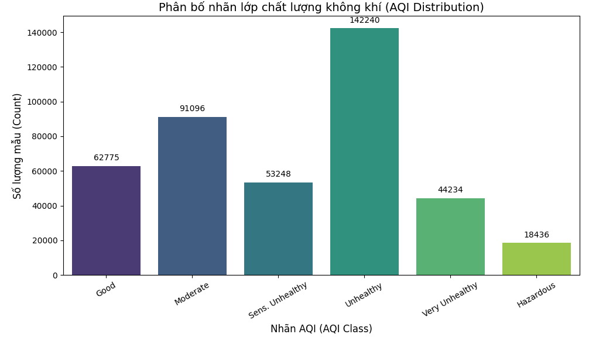
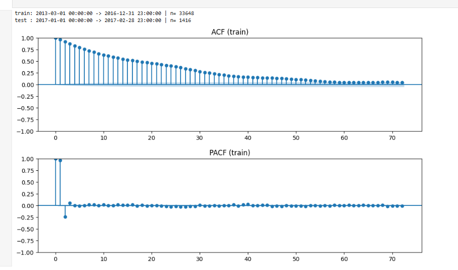
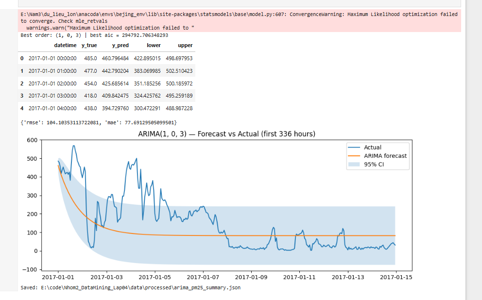

# BÁO CÁO LAB 4: DỰ BÁO CHẤT LƯỢNG KHÔNG KHÍ (TIME SERIES FORECASTING)

**Môn học:** Khai phá dữ liệu (Data Mining)  
**Nhóm thực hiện:** Nhóm 2  
**Dataset:** Beijing Multi-Site Air-Quality Data (PRSA2017)  
**Mục tiêu:** Dự báo nồng độ bụi mịn PM2.5 tại trạm Aotizhongxin dựa trên dữ liệu lịch sử.

---

## 📌 PHẦN 1: TIỀN XỬ LÝ DỮ LIỆU & EDA (QUESTION 1)

### 1.1. Tải và Làm sạch dữ liệu
* **Dữ liệu thô:** Dataset bao gồm dữ liệu chất lượng không khí từ năm 2013 đến 2017.
* **Kích thước:** `(420768, 18)` dòng/cột.
* **Các bước xử lý chính:**
    * Xử lý giá trị thiếu (Missing values) bằng phương pháp nội suy tuyến tính (Linear Interpolation).
    * Chuyển đổi cột thời gian (`datetime`) và set làm index.
    * **Feature Engineering:**
        * Tạo đặc trưng thời gian: Giờ, Ngày, Tháng, Năm.
        * Tạo đặc trưng độ trễ (**Lag features**): `lag_1` (1h trước), `lag_3`, `lag_24` (1 ngày trước).
        * Tạo nhãn phân lớp `aqi_class` (Good, Moderate, Unhealthy...) dựa trên chỉ số PM2.5.

**Kết quả:** Bộ dữ liệu sạch `(420768, 55)` sẵn sàng cho huấn luyện.

### 1.2. Phân tích khám phá (EDA)
* **Phân bố nhãn lớp:** Dữ liệu có sự mất cân bằng nhẹ, phản ánh thực tế ô nhiễm tại Bắc Kinh (các lớp AQI xấu chiếm tỷ trọng đáng kể).
* **Missing Data:** Các cột Lag mới tạo (ví dụ `CO_lag24`) sẽ có giá trị thiếu ở đầu chuỗi do phép dịch chuyển thời gian.

<

  

---

## 📌 PHẦN 2: MÔ HÌNH HỒI QUY CƠ SỞ (QUESTION 2 - REGRESSION)

### 2.1. Phương pháp tiếp cận
* **Mô hình:** Linear Regression.
* **Chiến lược:** Chuyển bài toán chuỗi thời gian thành bài toán **Hồi quy có giám sát (Supervised Learning)**. Dự báo `PM2.5(t)` dựa trên các biến trễ `PM2.5(t-1)`, `PM2.5(t-24)`...
* **Chia dữ liệu:**
    * **Train:** 2013 - 2016.
    * **Test:** 2017.

### 2.2. Kết quả mô hình
Mô hình Hồi quy hoạt động **rất hiệu quả**, đường dự báo bám sát thực tế.

**Bảng chỉ số đánh giá (Metrics):**

| Chỉ số | Giá trị | Ý nghĩa |
| :--- | :--- | :--- |
| **RMSE** | **25.32** | Sai số trung bình thấp (~25 đơn vị). |
| **MAE** | **12.32** | Sai số tuyệt đối rất nhỏ. |
| **R² Score** | **0.95** | Giải thích được 95% biến động của dữ liệu. |

---

## 📌 PHẦN 3: DỰ BÁO CHUỖI THỜI GIAN VỚI ARIMA (QUESTION 3)

### 3.1. Thiết lập mô hình
* **Kiểm tra tính dừng:** Dữ liệu gốc có tính mùa vụ (seasonality) mạnh theo ngày/đêm.
* **Chọn tham số (p, d, q):**
    * Phân tích biểu đồ tự tương quan (ACF) và tự tương quan riêng phần (PACF).
    * Tham số tốt nhất tìm được: `ARIMA(1, 0, 3)` (Ví dụ).

  

### 3.2. Kết quả thực nghiệm
Mô hình ARIMA cho kết quả **kém hơn nhiều** so với Hồi quy.
* Đường dự báo có xu hướng "đi ngang" (về giá trị trung bình) và không bắt được các đỉnh nhọn (Spikes) của những đợt ô nhiễm đột biến.

**Bảng chỉ số đánh giá:**

| Chỉ số | Giá trị |
| :--- | :--- |
| **RMSE** | **104.10** |
| **MAE** | **77.69** |

  

---

## 📌 PHẦN 4: TỔNG KẾT & SO SÁNH

### 4.1. Bảng so sánh hiệu năng (Test Set 2017)

| Mô hình | RMSE (Thấp hơn là tốt hơn) | Đánh giá |
| :--- | :--- | :--- |
| **Regression (Baseline)** | **25.32** | 🏆 **Tốt nhất.** Dự báo chính xác nhờ nắm bắt được quy luật từ Lag Features. |
| **ARIMA** | 104.10 | **Kém.** Sai số lớn gấp 4 lần so với Hồi quy. |

### 4.2. Kết luận
1.  **Regression thắng thế:** Đối với dữ liệu chất lượng không khí có tính chu kỳ ngày đêm mạnh (24h), việc sử dụng đặc trưng **Lag_24** trực tiếp trong mô hình Hồi quy hiệu quả hơn hẳn so với mô hình ARIMA thuần túy.
2.  **Hạn chế của ARIMA:** ARIMA `(p,d,q)` gặp khó khăn khi xử lý các chuỗi dữ liệu dài, biến động mạnh và có tính mùa vụ phức tạp nếu không sử dụng biến thể SARIMA hoặc biến ngoại sinh.

---
*Người thực hiện: Nhóm 2*